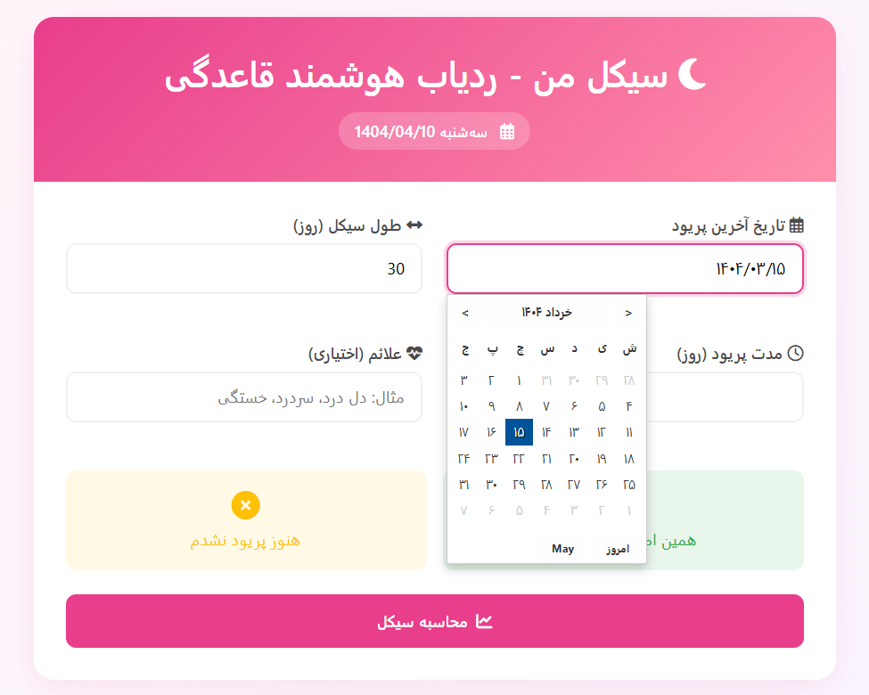
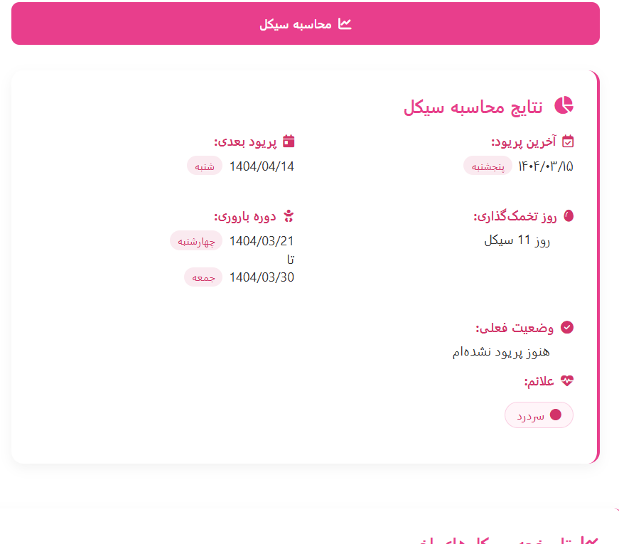
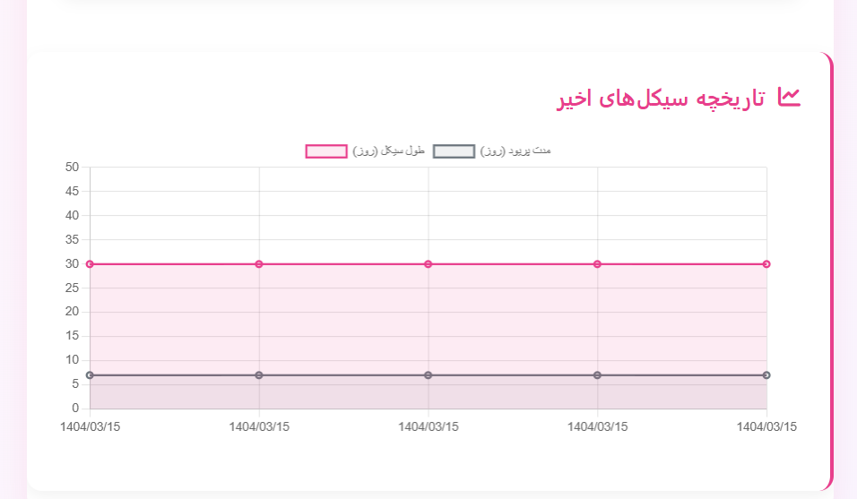

# 🩸 ردیاب دوره قاعدگی (سیکل من)







!


برنامه وب برای پیگیری و پیش‌بینی دوره‌های قاعدگی با تقویم شمسی

## ✨ ویژگی‌های کلیدی
- 📅 محاسبه خودکار بر اساس تاریخ آخرین پریود
- 🔄 پیش‌بینی دوره باروری و تخمک‌گذاری
- 📈 نمایش تاریخچه به صورت نمودار تعاملی
- 📱 طراحی واکنش‌گرا برای تمام دستگاه‌ها
- 🗓️ تقویم شمسی یکپارچه

## 🛠️ راه‌اندازی

### پیش‌نیازها
- Python 3.7+
- pip (مدیریت بسته‌های پایتون)

### مراحل نصب
1. دریافت کدها:
```bash
git clone https://github.com/VIDAKHOSHPEY22/Menstruation.git
cd Menstruation
```

2. ایجاد محیط مجازی:
```bash
python -m venv venv
# فعالسازی محیط:
# ویندوز: venv\Scripts\activate
# مک/لینوکس: source venv/bin/activate
```

3. نصب نیازمندی‌ها:
```bash
pip install -r requirements.txt
```

### اجرای برنامه
```bash
python app.py
```
سپس در مرورگر به آدرس زیر مراجعه کنید:
```
http://localhost:5000
```

## 📂 ساختار پروژه
```
├── data/
│   └── history.json       # ذخیره داده‌های کاربران
├── images/
│   ├── app-preview.png   
├── static/
│   └── style.css          # فایل استایل
├── templates/
│   └── index.html         # صفحه اصلی
├── app.py                 # فایل اصلی
├── requirements.txt       # لیست کتابخانه‌ها
└── README.md              # این فایل
```

## 📚 کتابخانه‌های اصلی
| کتابخانه | نسخه | کاربرد |
|----------|-------|--------|
| Flask | 3.0.0 | فریمورک وب |
| jdatetime | 5.0.0 | تاریخ شمسی |
| persiantools | 5.0.0 | ابزارهای فارسی |

## 🤝 مشارکت در توسعه
1. Issue جدید ایجاد کنید
2. پروژه را Fork نمایید
3. تغییرات را در Branch جدید اعمال کنید
4. Pull Request ارسال نمایید

## 📜 مجوز
این پروژه تحت [مجوز MIT](LICENSE) منتشر شده است.

## 📬 ارتباط با توسعه‌دهنده
- ایمیل: [vidatwin18@gmail.com](mailto:vidatwin18@gmail.com)
- GitHub: [VIDAKHOSHPEY22](https://github.com/VIDAKHOSHPEY22)

---

<div align="center">
با ❤️ برای سلامت زنان ایران
</div>

```
Flask==3.0.0
jdatetime==5.0.0
persiantools==5.0.0
```
